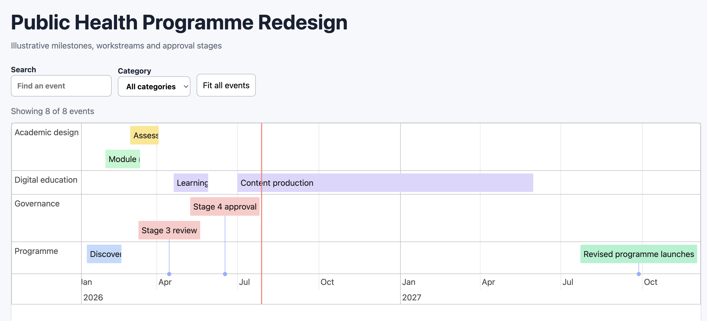

# CloudPedagogy Word Timeline Renderer

Convert structured tables in an editable Microsoft Word document into a standalone interactive timeline. Edit the supplied Word example and run one Python command; no JavaScript editing is required.

## Files and demonstration

- [Editable Word example](examples/timeline_example.docx)
- [Renderer script](render_timeline.py)
- [Generated HTML example](output/timeline_example/index.html)
- [Normalised example data](output/timeline_example/data.json)
- [Example QA report](output/timeline_example/qa_report.md)
- [Automated tests](tests/test_render_timeline.py)

## Live Demo

[View the Word Timeline Renderer demo](http://cloudpedagogy-word-timeline-renderer.s3-website.eu-west-2.amazonaws.com/)

## Screenshot

[](http://cloudpedagogy-word-timeline-renderer.s3-website.eu-west-2.amazonaws.com/)

## Quick start

Python 3.10 or later is recommended.

```bash
git clone https://github.com/cloudpedagogy/cloudpedagogy-word-timeline-renderer.git
cd cloudpedagogy-word-timeline-renderer

python3 -m venv .venv
source .venv/bin/activate
python3 -m pip install -r requirements.txt

python3 render_timeline.py examples/timeline_example.docx \
  --output output/timeline_example
```

On Windows PowerShell, activate the environment with:

```powershell
py -m venv .venv
.\.venv\Scripts\Activate.ps1
py -m pip install -r requirements.txt
py render_timeline.py examples/timeline_example.docx --output output/timeline_example
```

Open `output/timeline_example/index.html` in a browser.

## Create your own timeline

1. Make a copy of [the Word example](examples/timeline_example.docx).
2. Replace, add or remove rows in the `EVENTS` table.
3. Optionally change values in `SETTINGS`.
4. Keep the recognised table headings and required columns.
5. Run the renderer using your copied `.docx` file.

The `EVENTS` table requires a start/date column and a title/event column. Optional fields include ID, end date, description, category, group, colour and link. Common heading alternatives such as `Date`, `Start Date`, `Event`, `Name`, `Track`, `Type`, `Colour` and `URL` are accepted.

Dates may use `YYYY-MM-DD`, `DD/MM/YYYY`, common written English formats or ISO date-times. Blank rows are ignored.

## Customisation and limits

The renderer supports single events, date ranges, groups/tracks, categories, colours, descriptions, safe web links, search, filtering, zooming and stacking. The generated HTML embeds vis-timeline and works offline.

The input is flexible within the documented schema; it is not intended to interpret arbitrary Word tables. Preserve required columns, valid dates and recognised table headings.

## Output and validation

Each run creates:

- `index.html` — interactive offline timeline
- `data.json` — parsed and normalised data
- `qa_report.md` — errors and warnings

Useful commands:

```bash
python3 render_timeline.py --help
python3 render_timeline.py INPUT.docx -o OUTPUT_DIRECTORY --strict
python3 -m unittest discover -s tests -v
```

`--strict` returns a non-zero exit code when validation findings meet the script's strictness threshold.

## Licence

MIT. See [LICENSE](LICENSE).
